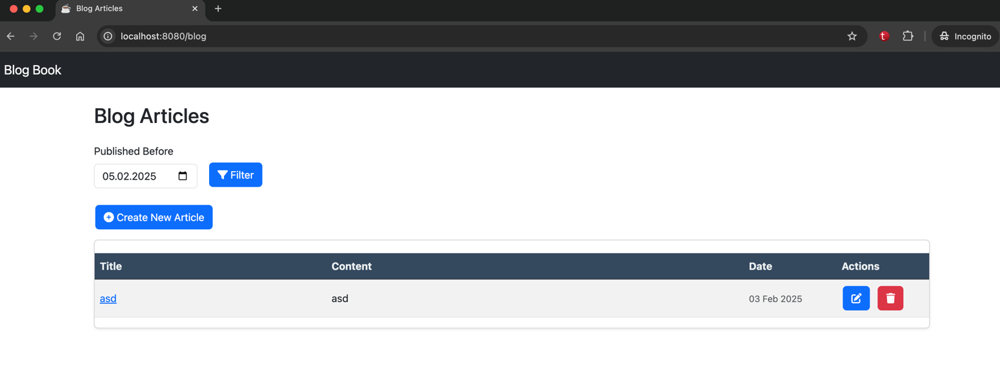
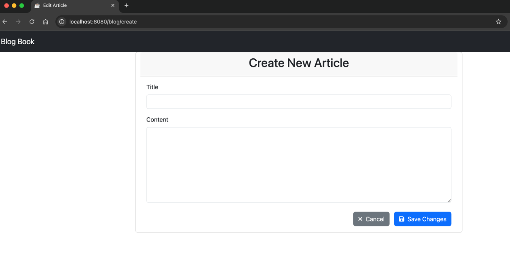
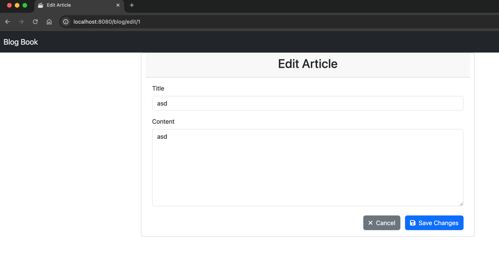

# Blog Application

A full-stack blog application built with Spring Boot and Thymeleaf that provides CRUD operations for articles.

## Features

- View all blog articles on the home page
- Create new articles with title and content
- Edit existing articles
- Delete articles
- Filter articles by publication date
- Responsive UI with Bootstrap
- MySQL database integration
- H2 in-memory database for testing
- Automated tests for controllers, services, and entities

## Technologies

- Java 17
- Spring Boot 3.2.4
- Spring Data JPA
- Thymeleaf templating
- MySQL Database
- H2 Database (for testing)
- Bootstrap 5
- JUnit 5
- Mockito

## Getting Started

### Prerequisites

- Java 17 JDK
- MySQL Server
- Gradle

### Installation

1. Clone the repository:
```bash
git clone https://github.com/mustafasygn/blog-application.git
cd blog-application
```

2. Configure MySQL database:
```bash
mysql -u root -p
CREATE DATABASE blog;
```

3. Update database credentials in `src/main/resources/application.properties`

### Running the Application

```bash
./gradlew bootRun
```

The application will be available at: http://localhost:8080

### Project Structure

```
src/main/java
├── com.blog
│   ├── controller       # MVC controllers
│   ├── entity           # Database entities
│   ├── repository       # Data repositories
│   ├── service          # Business logic
│   └── BlogApplication.java # Main application class
src/test/java            # Unit and integration tests
src/main/resources
├── static               # Static assets
└── templates            # Thymeleaf templates
```

### API Documentation

We provide OpenAPI 3.0 documentation in `swagger.yaml`. You can:
- View it in http://localhost:8080/swagger-ui/index.html
- Import into Postman
- Generate client SDKs

## Testing

Run all tests with:

```./gradlew test```

## Home Page


## Create Article


## Edit Article

